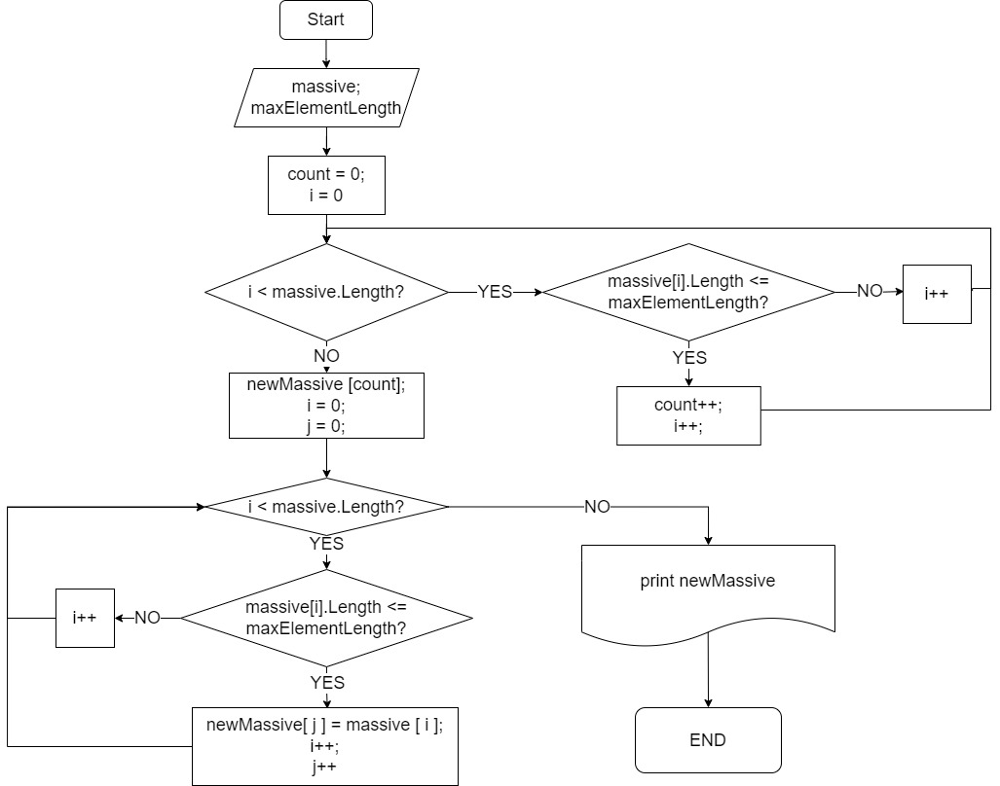

# Описание проекта "ControlProject"

##  *__Задание.__*
Написать программу, которая из имеющегося массива строк формирует новый массив из строк, длина которых меньше либо равна 3 символа. Первоначальный массив можно ввести с клавиатуры, либо задать на старте выполнения алгоритма. При решении не рекомендуется пользоваться коллекциями, лучше обойтись исключительно массивами.
***
*Проект написан на языке С#*

## *Алгоритм работы программы*
1. Посчитать, сколько элементов в заданом массиве состоят не более чем из 3-х символов, для этого объявить переменную **_count_**.
2. Создать новый массив размерностью **_count_**.
3. Все элементы, состоящие не более чем из 3-х символов, из заданого массива записать в новый массив.
4. Вывести новый массив в консоль.

## *Блок-схема*

